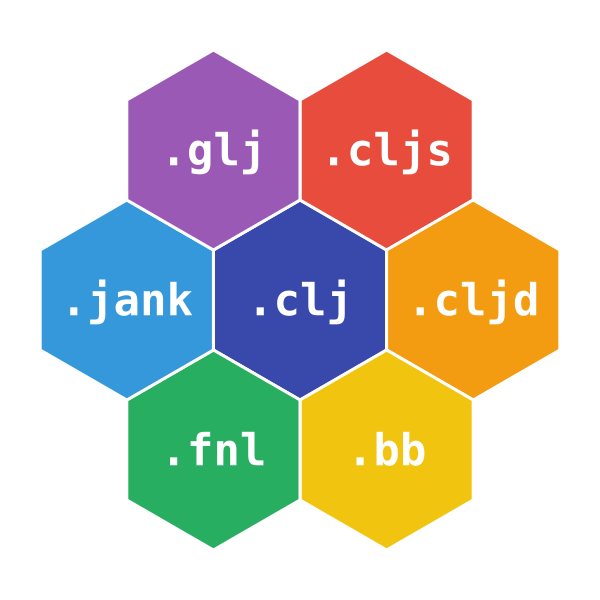

  
  <h1 class="hero-title">ClojureStar</h1>
  

    Discover, compare and try out dialects from the Clojure family of
    languages.
  

  

    <a href="dialects/" class="cta-button cta-primary">Clojure Dialects</a>
    <a href="cli/" class="cta-button cta-secondary">Try REPLs</a>
    <a href="repl/" class="cta-button cta-secondary">Browser REPL</a>
    <a href="blog/" class="cta-button cta-secondary">Blog</a>
  

## What is a Clojure dialect?

Clojure is a Lisp that runs on the JVM.
A **Clojure dialect** is any language that shares Clojure's syntax,
semantics or spirit, but targets a different host (Go, JavaScript, Python, C,
PHP, Erlang, the browser via WebAssembly, and more).

There are dozens of them.
Most people only know of two or three.
**ClojureStar** exists to put the whole family in one place.

## What you'll find here

  <a href="dialects/" class="feature-card">
    📚
    <h3 class="feature-title">Dialect catalog</h3>
    

      A curated, comparable list of active Clojure dialects: host platform,
      status, project links.
    

  </a>

  <a href="cli/" class="feature-card">
    ⚡
    <h3 class="feature-title">Instant REPLs</h3>
    

      One command launches a fully installed REPL for any supported dialect.
      No Java, Go or Python prerequisites.
    

  </a>

  <a href="repl/" class="feature-card">
    🕸️
    <h3 class="feature-title">Try in your browser</h3>
    

      An interactive Clojure REPL right on the page, powered by WebAssembly.
      Nothing to install.
    

  </a>

  <a href="blog/" class="feature-card">
    ✍️
    <h3 class="feature-title">From the Clojure family</h3>
    

      News, discoveries and stories from across the growing family of Clojure
      dialects.
    

  </a>

  Curated by <a href="https://clojurians.slack.com/archives/C0B655S3R19">Clojurians</a>!

